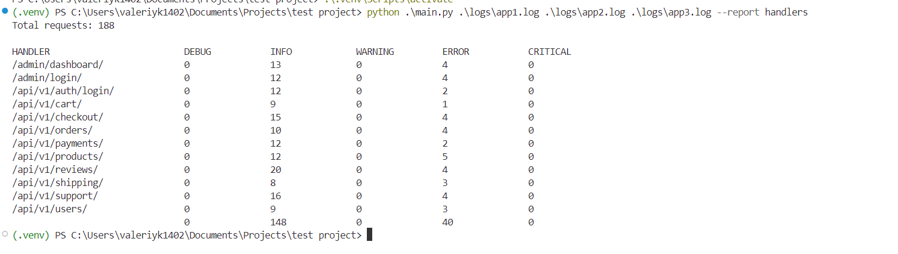

# Для добавления нового отчета

1. Добавляем метод в модуль report_types.py. В данном методе должна быть описана логика сбора информации из данных считываемых файлов, конечная информация для одного отчета формируется в словарь self.output, не забываем добавлять в него информация после окончания каждого Tread-а.
2. Ранее созданный метод вызывается в методе read_log_file того же модуля, в который добавляем условия проверки report_type который должен быть равен наименованию отчета который вы добавляете
3. Добавляем метод формирования отчета на вывод, который далее будет вызван после завершения всех Tread-ов в методе process_files_parallel
    - Вызов метода производится через условный оператор который проверяет наименование отчета, которое было передано при вызове cli-приложения под наименованным параметром --report
4. Добавляем логику тестирования нового отчета

## Скриншот запуска приложения 

